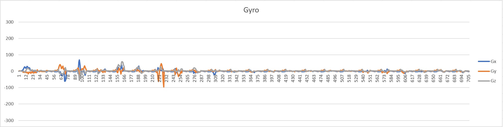
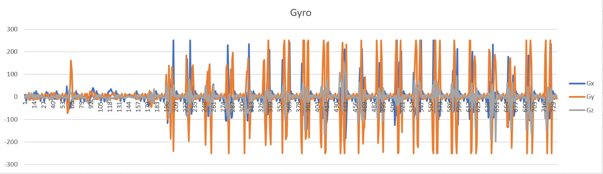
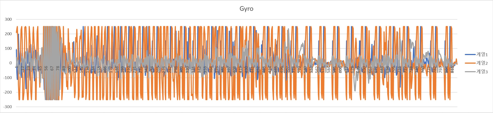

# 데이터 분석 결과보고 1

#### 분석 목표
Weka의 Classification Tool을 사용해 Classifier 모델을 생성하고 기존 실험에서 획득한 값을 적용해 그 결과를 확인한다.

#### 분석 진행
박동하 (luncliff@gmail.com )

## 요약

Training Set의 크기에 따른 결과를 볼 때, `NaiveBayes`의 정확도가 높아질 여지는 아직 있다고 생각된다. 오류 양상을 보면 보다 높은 정확도를 위해 추가적인 Attribute가 필요할 것으로 생각되며, `SVM` 속성을 별도로 분리하여 실험을 진행하는 것도 필요해 보인다.

## Background
[4차 실험](../Experiment/4th.md)에서는 크게 3가지 패턴을 확인할 수 있었다.

 - `idle` : 정적인 상태. 앉기, 눕기 등 
 - `walk` : 걸음걸이. 데이터의 주기적인 양상
 - `active` : 수풀에서의 움직임. `walk`보다 움직임이 많이 나타남

각각의 데이터 양상을 보여주는 그림은 다음과 같다. (위쪽부터 `idle`, `walk`, `active`)

| Pattern |
|:-------:|
|  |
|  |
|  |

## 분석 방법
기존에는 각 Transmission Unit 단위의 분석을 시도하였다. 이번 분석에서는 TU들을 일정한 개수만큼 묶어 그로부터 유도된 값을 사용해 분석을 시도한다. 

> #### Signal Magnitude Area : SMA
> A statistical measure of **the magnitude of a varying quantity**.   
> 

여기서 일정 개수만큼 묶어서 처리하는 이유는 SMA의 양상을 파악하기 위한 것이다. 

`N`개의 TU에 대해 SMA 값을 (이전에 누적된 데이터와 결합하여) `N`개를 생성할 수 있으며, 이들의 평균(Average)과 표준편차(Standard Deviation)를 구함으로써 **보다 급격한 변화와 완만한 변화를 구분할 수 있으리라 판단하였다.**

다만 현재는 앞서 언급한 3가지 패턴만을 적용하고 있으며, 자세 변화를 측정한 데이터는 수량부족으로 사용하지 못하였다.

### Derived Values
분석에 사용된 유도값들은 다음과 같다.

#### Per TU
 - `A SVM` : Accelerometer's Signal Magnitude Vector
 - `G SVM` : Gyroscope's Signal Magnitude Vector
#### Per Group
 - `A SMA Avg` : Average of Accelerometer's Signal Magnitude Area
 - `A SMA Stdev` : Standard Deviation of Accelerometer's Signal Magnitude Area
 - `G SMA Avg` : Average of Gyroscope's Signal Magnitude Area
 - `G SMA Stdev` : Standard Deviation of GyroscopeAccelerometer's Signal Magnitude Area
 
### Train/Test set 구성
묶음(Group)의 크기로는 7, 17, 29 를 사용하였으며, 이는 각각 1/4초, 1/2초, 1초 동안의 데이터에 해당한다.   
즉, 묶음의 크기가 7인 경우는 1/4초 단위로 반려견의 상태를 분류하는 것이며, 29초인 경우는 1초단위로 분류를 수행하는 것이다.

우선 이전의 실험 데이터를 양상에 따라 약 37개의 파일로 재구성하였다.

| Pattern   | Files |
|:---------:|------:|
| `idle`    | 7     |
| `walk`    | 9     |
| `active`  | 12    |
| `Trans`   | 9     |

#### Training Set

이를 조합해 Training(Learning) Set은 5개를 생성하였으며, 각각은 규모만 다를 뿐 `idle`, `walk`, `active`비율은 동일하도록 구성하였다.

| Set Name  | Scale |
|:---------:|------:|
| `L1`      | 906   |
| `L2`      | 2716  |
| `L3`      | 5414  |
| `L4`      | 8935  |
| `L5`      | 13258 |

5개의 Set을 사용해 규모가 커짐에 따라 변화하는 정확도의 양상을 파악할 수 있을 것이다.

#### Test set

추가로, Traning Set에 사용되지 않은 데이터들을 사용해 Test Set을 구성하였다. 이에 따라 Model을 생성하는데 사용된 데이터돠 검증하는데 사용되는 데이터 사이의 중첩이 없게 되었다.

Test Set은 1482개로 구성되었으며, 이는 가장 큰 Training Set인 `L5`의 약 1/10에 해당한다. Test Set 또한 Group의 크기 7, 17, 29 각각에 맞춰 생성하였다.

## 분석 결과
Modeling에는 Weka에 기본 내장된 `NaiveBayes`를 사용하였다. 비교를 위하 `J48`을 함께 사용하였다. Train Set의 크기가 증가함에 따라 양쪽 모두 정확도의 상승을 보였다.

### Decision Tree
`J48`을 사용할 경우, 경우에 따라서 과도하게 많은 수의 Leaves가 생성되는 것을 확인하였다.

| Group Size | Leaves | Precision |
|-----------:|-------:|----------:|
| 7          | 261    | 70.50%    |
| 17         | 67     | **83.99%**    |
| 29         | 29     | 75.08%    |

### Naive Bayes
`NaiveBayes`의 정확도는 `J48`에 비해 상대적으로 낮은 양상을 보였다. 특기할만한 점은 양쪽 모두 Group크기가 17인 경우 더 높은 정확도를 보였다는 것이다.

| Train Set | Scale | 7      | 17     | 29     |
|-----------|------:|-------:|-------:|-------:|
| `L1`      | 906   | 29.70% | 26.19% | 24.03% |
| `L2`      | 2716  | 26.94% | 19.17% | 37.00% |
| `L3`      | 5414  | 64.55% | 59.01% | 49.08% |
| `L4`      | 8935  | 72.58% | 60.02% | 44.36% |
| `L5`      | 13258 | 74.34% | **76.43%** | 62.59% |

**대부분의 오류는 `walk`와 `active`를 분류하면서 발생**하였으며, 
`idle`과 `walk`사이에서 발생하는 오류는 적은 편이었다. 이런 결과가 나온 원인은 TU단위로 적용되는 SVM과 Group 단위로 적용되는 SMA가 함께 사용되었기 때문인 것으로 추측된다. 

## 결론
 - 기존에 수집한 데이터를 기반으로 Train/Test Set을 생성하였다.
 - `J48`과 `NaiveBayes`에 이를 적용하였다.
    - `J48`은 높은 정확도를 보였으나, 과도하게 많은 Leaves를 확인.
    - `NaiveBayes`에서 상대적으로 낮은 정확도를 확인.

Training Set의 크기에 따른 결과를 볼 때, `NaiveBayes`의 정확도가 높아질 여지는 아직 있다고 생각된다. 오류 양상을 보면 보다 높은 정확도를 위해 추가적인 Attribute가 필요할 것으로 생각되며, `SVM` 속성을 별도로 분리하여 실험을 진행하는 것도 필요해 보인다.

