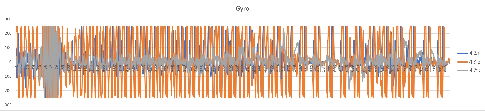

# 4차 실험 결과보고

#### 실험 목표
반려견이 착용한 IMU 센서 값을 수집하여 추가적인 값들을 유도하고, 그 양상을 분석한다.

#### 실험 결과
  1. 자이로 센서값을 중심으로 3가지 패턴을 파악할 수 있었다.

## 실험 내용
 - 실험 진행 : 박동하(luncliff@gmail.com)

### 실험 대상

3차 실험 대상과 동일함.

 - 견종 : 요크셔테리어
 - 나이 : 5년
 - 체고 : 약 30cm
 - 신장 : 약 48cm
 - 체중 : 4.7kg

### 실험 구성
실험 데이터는 3차실험과 동일하게 실험장비를 착용하고 야외에서(일반 산책로, 수풀) 무작위적으로 측정하였다.

 - +Z (바닥), -Z (천장)
 - +Y (앞쪽), -Y (뒤쪽)
 - +X (오른쪽), -X (왼쪽)
 - 자이로의 축은 별도로 조정하지 않음.

### 기대 결과
 1. 무작위적으로 측정한 데이터를 바탕으로 현재 강아지가 취하고 있는 행동을 대략적으로 알 수 있다.

## 실험 결과

### 결과 데이터
 - **[Excel Chart](../Experiment/4th/4thData.xlsx)**
 - [Text format](../Experiment/4th/raw/)
 - [ARFF format](../Experiment/4th/arff/)

## 결과 분석

결과에서 중력축과의 각도차는 문제없이 유도될 수 있었으나, 착용부위를 고정시켜야 한다는 문제가 있어 분석 대상에서는 제외하였다. (수집은 향후 실험에서도 계속함)

### Pattern A (Idle)

| Raw Data |
| -------- |
|  |
|  |

#### Acc
안정적인 상태에서 가속도값은 거의 변화하지 않았다. 특기할만한 점은 가속도에 대한 SMA30의 값이 `[1.5,2.0]` 구간 내에서 유지된다는 점이며, 이는 다른 활동적인 패턴들도 부분적으로 벗어나는 정도로 그쳤다.

#### Gyro
앉아있거나 누워있는 경우 몸에 거의 움직임이 없었기 때문에 자이로 센서 역시 안정적인 상태를 유지하였다. 
운동량을 나타내는 SMV 값에 큰 변화가 없으며, SMA30 값 역시 50 미만으로 유지되었다.

| Derived Data |
| -------- |
|  |
|  |

### Pattern B (Walk)

B 패턴의 특징은 A 패턴에 비해 자이로 센서의 변화가 두드러지며, 주기성을 보인다는 점이다. 이 주기는 소형견/중형견/대형견 모두 다를 것으로 추정된다. 

| Raw Data |
| -------- |
|  |
|  |

#### Acc
걸음을 걸을 때마다 충격에 의한 변화가 확인된다. 센서 축에 따라 값의 범위가 제각각이기 때문에 가속도 센서 상에서의 변화를 감지하는 것은 SMV로 변환하여 수행해야 할 것으로 보인다.

#### Gyro

| Derived Data |
| -------- |
|  |
|  |

자이로센서의 SMV역시 주기적인 변화를 보여 안정적인 상태에서의 패턴과 확연한 차이가 보인다. 특히 임계점을 기준으로 사용하여 강아지의 걸음횟수를 측정할 수 있을 것이라 생각된다.

자이로 SMA의 경우, 안정적인 상태에서는 0에 근사하였던 것과는 달리, 50 이상의 구간에 유지되는 것을 확인할 수 있었다.

### Pattern C (Active)

| Raw Data |
| -------- |
|  |
|  |

#### Acc
C 패턴은 수풀에서 돌아다니는 동안 측정된 것으로, 앞서 B 패턴에 비해 더 많은 값의 변화를 관측할 수 있었다. 이는 강아지의 잔걸음 수가 늘어나고 움직임이 활발해졌음을 보여준다.

#### Gyro
하지만 이에 따라 자이로 센서의 SMV등으로 주기성을 파악하기에는 무리가 있어 보이며, B 패턴과는 다른 기준을 적용하여야 할 것으로 보인다. 기존보다 높아진 SMA 값을 사용해 C 패턴과 B 패턴의 구분하여야 할 것이다.

| Derived Data |
| -------- |
|  |
|  |

## 결론
  1. 자이로 센서값을 중심으로 3가지 패턴을 파악할 수 있었다.
     1. A(안정) : Gyro SMA < 50
     1. B(걷기) : Gyro SMA > 50
     1. C(활발) : Gyro SMA > 200
